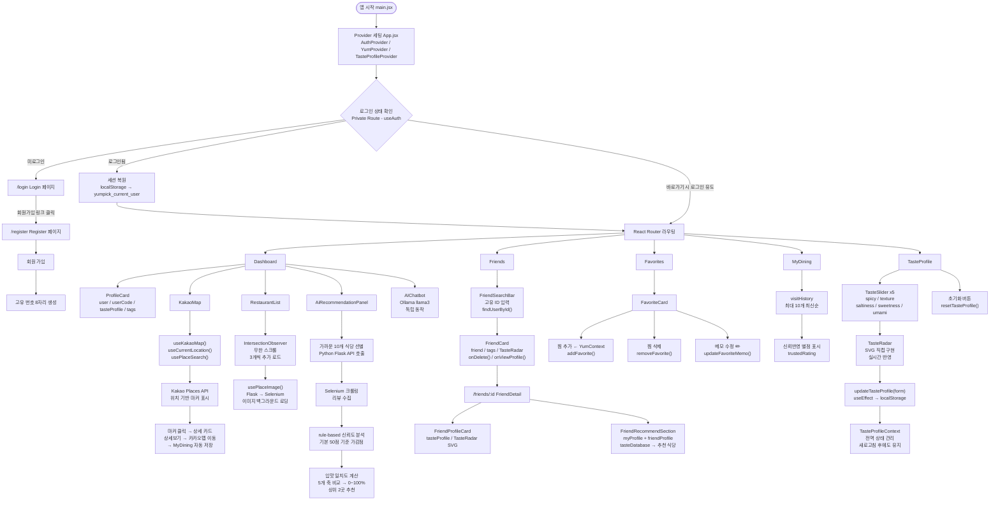

```mermaid
flowchart TD
    A(["앱 시작 main.jsx"]) --> B["Provider 세팅 App.jsx\nAuthProvider / YumProvider / TasteProfileProvider"]
    B --> C{"로그인 상태 확인\nPrivate Route - useAuth"}
    C -->|"미로그인"| D["/login Login 페이지"]
    C -->|"로그인됨"| E["세션 복원\nlocalStorage → yumpick_current_user"]
    D -->|"회원가입 링크 클릭"| F["/register Register 페이지"]
    F --> G["회원 가입"] --> H["고유 번호 8자리 생성"]
    E --> I["React Router 라우팅"]
    C -->|"바로가기 시 로그인 유도"| I

    I --> J["Dashboard"]
    I --> K["Friends"]
    I --> L["TasteProfile"]
    I --> M["Favorites"]
    I --> N["MyDining"]

    J --> J1["ProfileCard\nuser / userCode / tasteProfile / tags"]
    J --> J2["KakaoMap"]
    J2 --> J2A["useKakaoMap()\nuseCurrentLocation()\nusePlaceSearch()"]
    J2A --> J2B["Kakao Places API\n위치 기반 마커 표시"]
    J2B --> J2C["마커 클릭 → 상세 카드\n상세보기 → 카카오맵 이동\n→ MyDining 자동 저장"]
    J --> J3["RestaurantList"]
    J3 --> J3A["IntersectionObserver\n무한 스크롤\n3개씩 추가 로드"]
    J3A --> J3B["usePlaceImage()\nFlask → Selenium\n이미지 백그라운드 로딩"]
    J --> J4["AiRecommendationPanel"]
    J4 --> J4A["가까운 10개 식당 선별\nPython Flask API 호출"]
    J4A --> J4B["Selenium 크롤링\n리뷰 수집"]
    J4B --> J4C["rule-based 신뢰도 분석\n기본 50점 기준 가감점"]
    J4C --> J4D["입맛 일치도 계산\n5개 축 비교 → 0~100%\n상위 2곳 추천"]
    J --> J5["AIChatbot\nOllama llama3\n독립 동작"]

    K --> K1["FriendSearchBar\n고유 ID 입력\nfindUserById()"]
    K1 --> K2["FriendCard\nfriend / tags / TasteRadar\nonDelete() / onViewProfile()"]
    K2 --> K3["/friends/:id FriendDetail"]
    K3 --> K4["FriendProfileCard\ntasteProfile / TasteRadar SVG"]
    K3 --> K5["FriendRecommendSection\nmyProfile + friendProfile\ntasteDatabase → 추천 식당"]

    M --> M1["FavoriteCard"]
    M1 --> M2["찜 추가 ← YumContext\naddFavorite()"]
    M1 --> M3["찜 삭제\nremoveFavorite()"]
    M1 --> M4["메모 수정 ✏️\nupdateFavoriteMemo()"]

    N --> N1["visitHistory\n최대 10개 최신순"]
    N1 --> N2["신뢰반영 별점 표시\ntrustedRating"]

    L --> L1["TasteSlider x5\nspicy / texture\nsaltiness / sweetness / umami"]
    L1 --> L2["TasteRadar\nSVG 직접 구현\n실시간 반영"]
    L2 --> L3["updateTasteProfile(form)\nuseEffect → localStorage"]
    L3 --> L4["TasteProfileContext\n전역 상태 관리\n새로고침 후에도 유지"]
    L --> L5["초기화 버튼\nresetTasteProfile()"]
```
