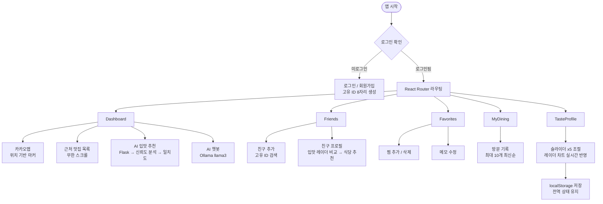

```mermaid
flowchart TD
    A(["앱 시작"]) --> B{"로그인 확인"}
    B -->|"미로그인"| C["로그인 / 회원가입\n고유 ID 8자리 생성"]
    B -->|"로그인됨"| D["React Router 라우팅"]

    D --> E["Dashboard"]
    D --> F["Friends"]
    D --> G["Favorites"]
    D --> H["MyDining"]
    D --> I["TasteProfile"]

    E --> E1["카카오맵\n위치 기반 마커"]
    E --> E2["근처 맛집 목록\n무한 스크롤"]
    E --> E3["AI 입맛 추천\nFlask → 신뢰도 분석 → 일치도"]
    E --> E4["AI 챗봇\nOllama llama3"]

    F --> F1["친구 추가\n고유 ID 검색"]
    F --> F2["친구 프로필\n입맛 레이더 비교 → 식당 추천"]

    G --> G1["찜 추가 / 삭제"]
    G --> G2["메모 수정"]

    H --> H1["방문 기록\n최대 10개 최신순"]

    I --> I1["슬라이더 x5 조절\n레이더 차트 실시간 반영"]
    I1 --> I2["localStorage 저장\n전역 상태 유지"]
```
