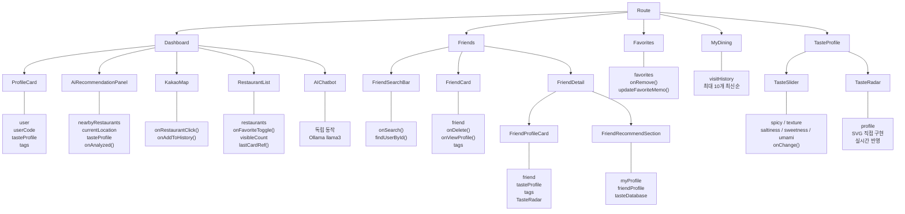

## 🧩 컴포넌트 계층 구조

```mermaid
flowchart TD
    Route --> Dashboard
    Route --> Friends
    Route --> Favorites
    Route --> MyDining
    Route --> TasteProfile

    Dashboard --> ProfileCard
    Dashboard --> AiRecommendationPanel
    Dashboard --> KakaoMap
    Dashboard --> RestaurantList
    Dashboard --> AIChatbot

    ProfileCard --- PC["user\nuserCode\ntasteProfile\ntags"]
    AiRecommendationPanel --- AI["nearbyRestaurants\ncurrentLocation\ntasteProfile\nonAnalyzed()"]
    KakaoMap --- KM["onRestaurantClick()\nonAddToHistory()"]
    RestaurantList --- RL["restaurants\nonFavoriteToggle()\nvisibleCount\nlastCardRef()"]
    AIChatbot --- BOT["독립 동작\nOllama llama3"]

    Friends --> FriendSearchBar
    Friends --> FriendCard
    Friends --> FriendDetail

    FriendSearchBar --- FS["onSearch()\nfindUserById()"]
    FriendCard --- FC["friend\nonDelete()\nonViewProfile()\ntags"]
    FriendDetail --> FriendProfileCard
    FriendDetail --> FriendRecommendSection
    FriendProfileCard --- FPC["friend\ntasteProfile\ntags\nTasteRadar"]
    FriendRecommendSection --- FRS["myProfile\nfriendProfile\ntasteDatabase"]

    Favorites --- FAV["favorites\nonRemove()\nupdateFavoriteMemo()"]

    MyDining --- MD["visitHistory\n최대 10개 최신순"]

    TasteProfile --> TasteSlider
    TasteProfile --> TasteRadar
    TasteSlider --- TS["spicy / texture\nsaltiness / sweetness / umami\nonChange()"]
    TasteRadar --- TR["profile\nSVG 직접 구현\n실시간 반영"]
```
